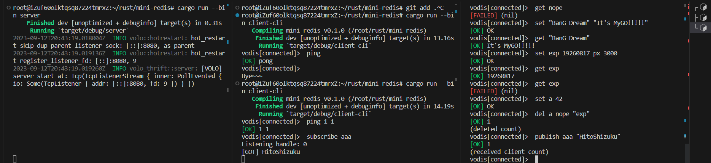
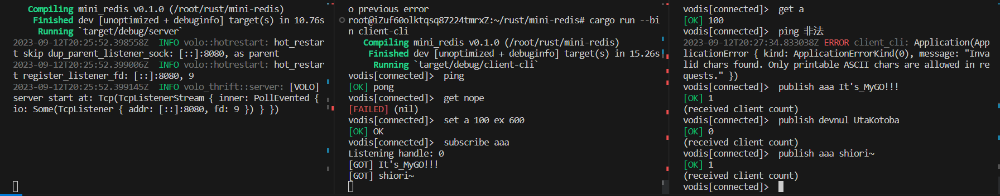

# Volo Redis

迷你redis实验作业，基于volo-thrift.  

## 用法

`cargo run --bin server` 启动服务（端口8080）
`cargo run --bin client-cli` 客户端CLI

## 已实现命令
- ping （完整支持）
- get （完整支持）
- del （完整支持，批量）
- set （支持过期时间）
- publish*
- subscribe*
- client-cli
- 中间件 （过滤非ASCII可打印字符，请求计时）

## TODOs

- 布隆过滤器
- 持久化（AOF）
- Cluster模式
- 主从模式

## 备注

\* **WIP 订阅相关加锁有一些改进进行中，需要更细粒度的锁。目前客户端使用间隔轮询。**

返回的请求Err/Ok更多代表数据、命令格式是否正确，而返回体中的`ok`字段更多表示操作是否成功。  
功能验证参考命令（请务必先启动服务端）：  
```plaintext
ping
ping "114 514" 1919 810
get nope
set abc xyz
get abc
set tenmin 19260817 ex 600
get tenmin
ping 啊波测得
subscribe aaa
```
```plaintext
publish aaa abcdefg
```

## 运行示例

